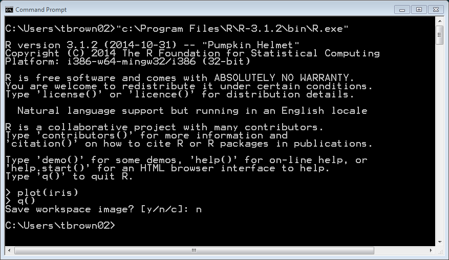
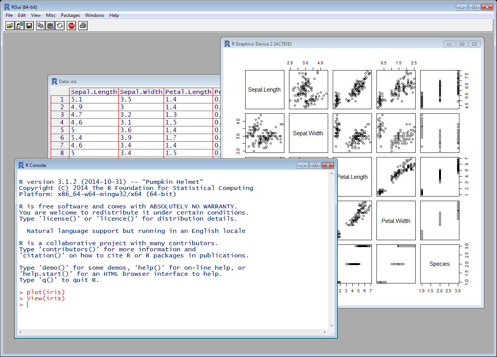
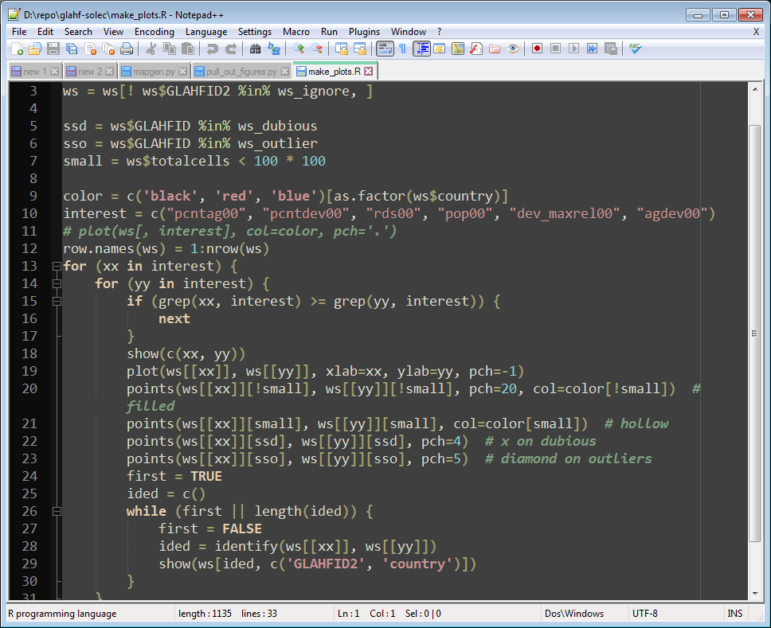
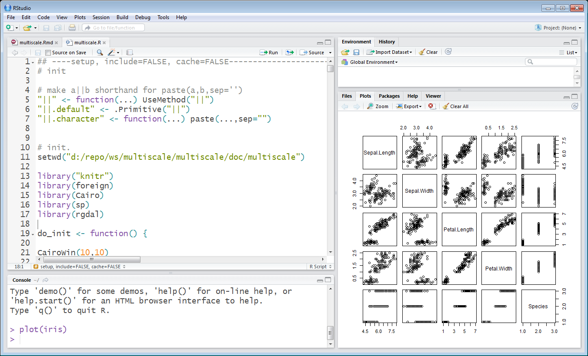
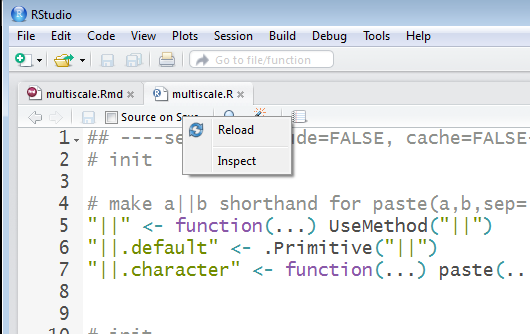
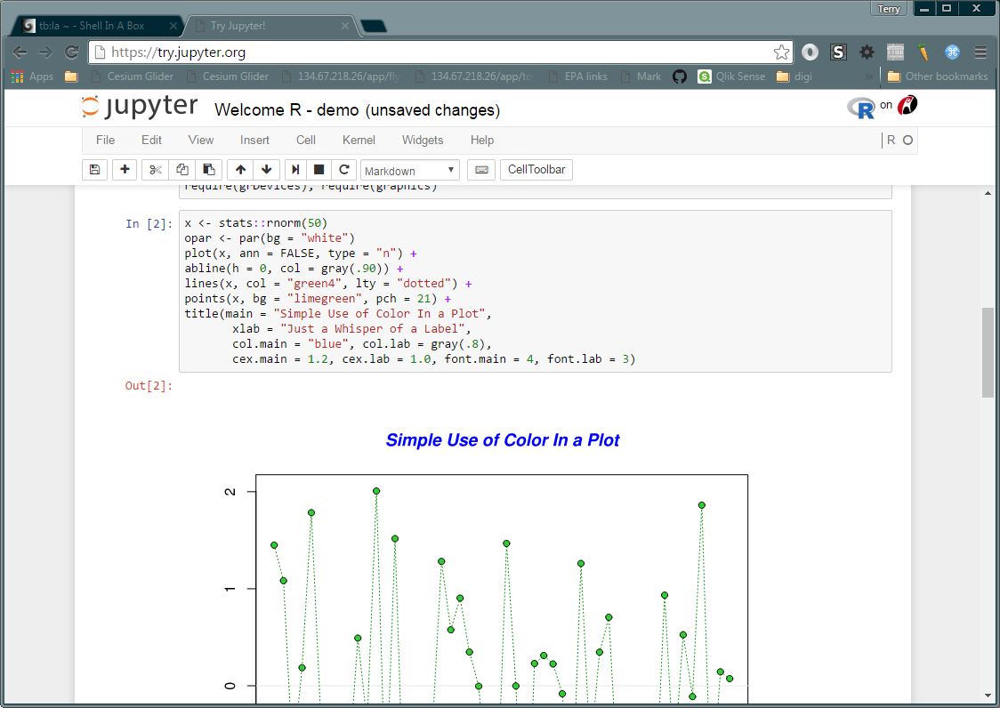
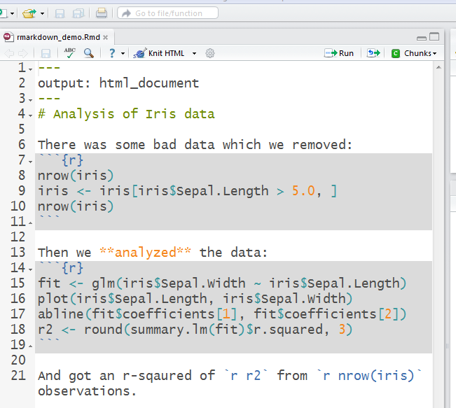

# R Ecosystem

## Different ways of using R

http://tbnorth.github.io/r_ecosystem/

Terry N. Brown

Brown.TerryN@epa.gov


## R is a command line program




## Which has a GUI




## Run it from your favorite editor




## A lot of people use R-Studio




# R-Studio is a web app.



R-Studio *Server* runs in your browser


## Jupyter runs in your browser




## R uses “packages” or “libraries”

 - some build on R, adding statistical functions, plotting frameworks, etc.
 
 - others provide access to other data types and services
 
    - load / process geo-spatial data
    - access databases
    - etc. etc.

```
library(rgdal)
library(xlsx)
...
mng <- read.xlsx("../recv/GL_basin.xlsx", "mining")
shape <- readOGR(dsn = ".", layer = "C:/workspace/some.shp")
```


## R-Markdown




## R-Markdown

 - [HTML output](doc/rmarkdown_demo.html)
 - [PDF output](doc/rmarkdown_demo.pdf)
 - Word output, others
 - Citation support
 - Some output formats can be sent directly to some journals
 - Jupyter has similar features


## R-Shiny

 - Interactive on-line R apps.
 - Author specifies which parameters can be modified
 - Requires server / shinyapps.io
 - http://shiny.rstudio.com/gallery/faithful.html


## R Studio / Foundation / Consortium / CRAN

 - R and related libraries are *mostly* free, open
   source software (FLOSS). https://www.r-project.org/
 - The R Foundation manages the above
 - The Comprehensive R Archive Network (CRAN) distributes the above
 <hr/>
 - R Studio is a company that offers free and paid versions of its
   products: R Studio, R Studio Server, R Shiny, etc.
 - The R Consortium is a collaboration of all the above plus Microsoft,
   Google, Oracle, HP, etc.


## Other integrations

 - git integration for projects in R-Studio
 - packages can be installed from GitHub as well as CRAN
 - support for parallel processing available in various environments
